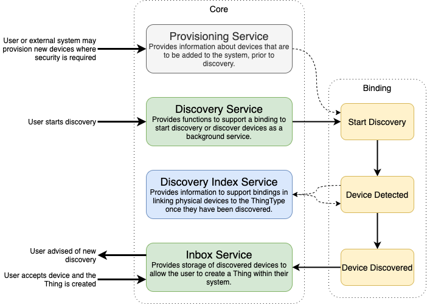
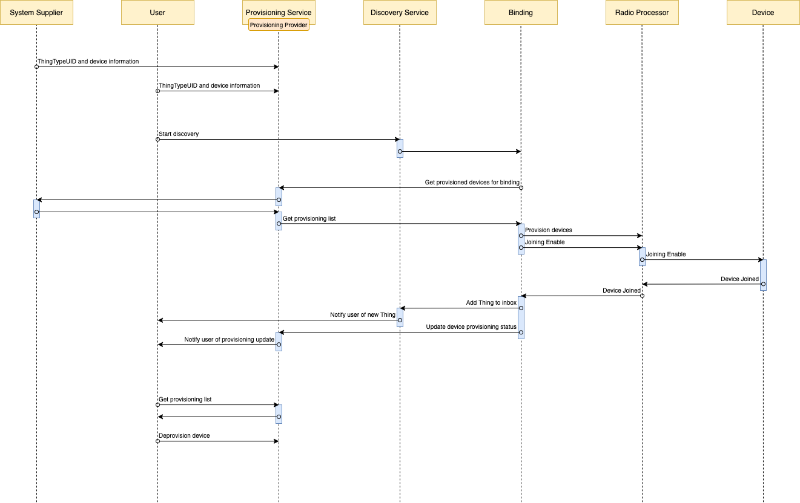

# Overview

OpenSmartHouse provides features to support provisioning and discovery of devices in support of bindings requiring up-front information before a device can be discovered, or to support Enterprise systems where a centralised provisioning system may be employed to manage the _Thing_ lifecycle.

The discovery system is made up of a number of parts as shown in the image below, and which will be described further in this document. This supports all phases of the discovery lifecycle as follows -:

* Provisioning to provide up-front information about devices before they can be discovered
* Discovery services to support the actual discovery and user interaction with the discovery system
* Discovery index services to map a physical device to a thing type
* Inbox services to store the discovery results and allow user interaction for deployment 

# Thing Provisioning

OpenSmartHouse provides provisioning interfaces to support _Thing_ lifecycle management. The `ProvisioningService` provides an interface between the binding, the user, and a registry which provides provisioning data. The `ProvisioningProvider` may be a local provider, allowing the local user to enter provisioning data through a UI, or scanning a QR code on a device, or it may be backed by a remote server, providing central provisioning data.

Many modern systems require up-front data before a device can be discovered and added to a network. This data normally consists of a unique identifier, and a security key, and without this information, the user, or the binding, may not be able to detect that the device exists. This information may be provided on the box if a device is purchased through a retail outlet, or it could be provided from a central system. 

Consider the following use cases: 

* A home owner purchases a new device from their local store. They scan the QI code on the box, they plug in the device, click a button on the hub, and it is automatically installed.
* A home owner goes online to purchase a new device from their system supplier. The supplier ships the device to the consumer, and adds the provisioning information to the consumers hub. When the consumer receives the device, they plug in the device, click a button, and it is automatically installed.
* A building manager wants to install new power meters in a block of flats. They record the ID of the device for each flat in their central BMS system and the maintenance personell install the unit. The hub is provisioned with the information and the meter is automatically installed into the BMS network.

To aid these use cases, OpenSmartHouse supports the registration of multiple _Provisioning Providers_. For example, a system could have a local `ProvisioningProvider` to support devices purchased by the user, and a central `ProvisioningProvider` to allow the service provider to offer a more streamlined service for devices purchased directly from them.

# Thing Discovery

Many devices, technologies and systems can be automatically discovered on the network or browsed through some API. It therefore makes a lot of sense to use these features for a smart home solution.

OpenSmartHouse bindings therefore implement _Discovery Services_ for Things, which provide _Discovery Results_. All _Discovery Results_ are regarded as suggestions to the user and are put into the _inbox_.

### Background Discovery

Some discovery services support automatic discovery in the background, while for others a scan needs to be triggered manually.
Services that support background discovery usually have it enabled by default. 
It is possible to override this setting and deactivate background discovery for individual services by setting `discovery.<serviceid>:background=false`, where `serviceid` is usually identical to a binding id, e.g. the LIFX background discovery can be disabled through `discovery.lifx:background=false`.

# Discovery Index

The `DiscoveryIndex`  is provided in support of bindings that may support a large number of things, and where a ThingHandler is not provided for each _Thing_, but the _Thing_ functionality is either self described by the device, or provided as part of the _Thing_ description file. The `DiscoveryIndex`  provides functions to map physical device data that a binding may use to decide the _ThingType_. The `DiscoveryIndex` is backed by a `DiscoveryIndexProvider` which may provide Discovery Index information through a number of means - eg it could be included in the Thing definition XML file, or it could be backed by a cloud service or a separate properties file.

The `DiscoveryIndex` service allows a binding to query the index with a binding supplied `DiscoveryIndexComparator` which allows the binding to interpret the `DiscoveryProperties` as it requires. The `DiscoveryIndex` will then return a _Set_ of _ThingTypeUID_ for all _Things_ that have a match in the index. The binding can then decide how to interpret this, or which _ThingType_ should be added to the Inbox and presented to the user.

# Inbox

The inbox holds a list of all discovered Things (`DiscoveryResult`) from all active discovery services. 
A discovery result represents a discovered Thing of a specific Thing type, that could be instantiated as a Thing. 
The result usually contains properties that identify the discovered Things further like IP address or a serial number. 
Each discovery result also has a timestamp when it was added to or updated in the inbox and it may also contain a time to live, indicating the time after which it is be automatically removed from the inbox. 

Discovery results can either be ignored or approved, where in the latter case a Thing is created for them and they become available in the application. 
If an entry is ignored, it will be hidden in the inbox without creating a Thing for it. 

OpenSmartHouse offers a service to automatically ignore discovery results in the inbox, whenever a Thing is created manually, that represents the same Thing, as the respective discovery result would create. 
This Thing would either have the same Thing UID or the value of its representation property is equal to the representation property's value in the discovery result.
This service is enabled by default but can be disabled by setting `org.openhab.inbox:autoIgnore=false`. 

## Auto Approve

If the manual acceptance of discovery results by the user is not desired, it is possible to turn on the auto-approval feature of the inbox.
In this case, every new entry gets automatically approved immediately (unless it has been marked as ignored as a duplicate).

The auto approval can be enabled by the setting `org.openhab.inbox:autoApprove=true`; the default is false.
