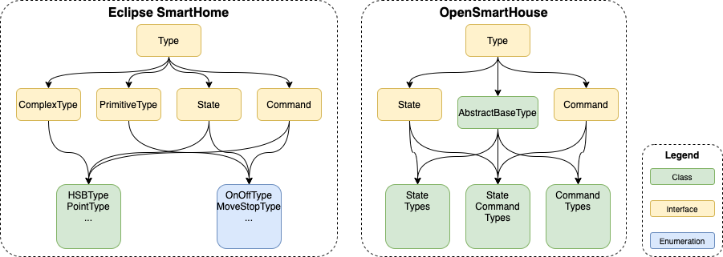

# Commands, States and Items

<nav aria-label="breadcrumb">
  <ol class="breadcrumb">
    <li class="breadcrumb-item"><a href="../index.php">Developers Guide</a></li>
    <li class="breadcrumb-item"><a href="index.php">Fundamental Concepts</a></li>
    <li class="breadcrumb-item active" aria-current="page">Items</li>
  </ol>
</nav>

## Type System Overview

_OpenSmartHouse_ has a flexible type system that needs to be understood by developers before heading in to develop core or extension bundles. Here we will try to explain the system, how it is built and used, and how the developer can interact with it.

The _OpenSmartHouse_ system is fundamentally similar to that derived from Eclipse SmartHome, and still used in _OpenSmartHouse_. It is however implemented very differently and provides a broader range of use cases. Firstly, let's explain the terminology -:

* **Type**: A _Type_ is a fundamental building block of the type system in _OpenSmartHouse_. All _Commands_ and _States_ are derived from _Type_. A _Type_ may be a simple class such as a _Number_ or _String_, or an enumeration such as _OpenClosed_ or _OnOff_. Or it may be a more complex class such as _HSB_ which inherits functionality from simpler classes such as _OnOff_ and _Percent_.
* **Command**: A _Command_ is an interface definition that marks a _Type_ as a _Command_ which can be sent to make something happen. For example you might want to _Command_ a light On with the _OnOff_ type.
* **State**: A _State_ is an interface definition that marks a _Type_ as a _State_. A _State_ provides feedback about the current condition. For example, a light might change state when someone turns on the light switch, and this would send a _State_ update with the _OnOff_ type, or possibly the _Percent_ type if the light was a dimmer.
* **Item**: An _Item_ is the users view of functionality. An _Item_ encapsulates the functionality of various _State_s and _Command_s to provide the real-world interaction a user requires. For example, a _Dimmer_ item may allow commands of _OnOff_ or _Percent_ and provide states of _OnOff_ or _Percent_.

## Attributes

_Attributes_ are additional elements of information that help to describe a _State_ or a _Command_. For example, _Attributes_ might be used with an _Item_ that is used to show the state of a door lock. The _Item_ may be of type _OnOffType_, and map be _ON_ when locked and _OFF_ when unlocked. Attributes could be used when the _State_ is updated to provide information about the state change. For example, it might describe the UserId of the user who unlocked the door, or the method by which the door was unlocked (eg by key, keypad or RFID). Similarly, an example of the use of _Attributes_ with a _Command_ could be to support a _DimmerType_. The dimmer may be changed from 0% to 75%, and an _Attribute_ may be used to provide the duration over which the change should occur (eg change from 0% to 75% over 2 seconds).

_Attributes_ are described as part of the channel definition. This provides a level of enforcement and prior knowledge of the _Attributes_ that a binding can send. It ensures that the User Interface can present this information to the user. _Attributes_ may be described by the binding, or may be described by the system where common _Attributes_ may be defined to ensure a common definition throughout the system.

## Class Hierarchy changes from Eclipse SmartHome Types

_OpenSmartHouse_ uses a type system that is externally similar to that defined by _Eclipse SmartHome_, however it is implemented quite differently to allow additional features to be supported. From a user perspective, most of the classes are the same, and these differences are hidden, but the hierarchy is different and developer may find some things need to be handled differently.

_Eclipse SmartHome_ defined a system which makes extensive use of interfaces - each type implementing multiple interfaces with a circular hierarchy, and potentially deriving from a different base class (eg Number) or `enum`. This makes it impossible to build a type system which derives from an abstract class from which base functionality is provided.

_OpenSmartHouse_ addresses this with a simplified type system where the multiple implementations of interfaces is reduced to a more manageable level, and an `AbstractBaseType` is introduced to support core functionality within the framework such as improved security and auxillary command or state information.  The following diagram provides a comparison of the two approaches -:



In most instances, there is no change required, however there are two key changes that could introduce incompatabilities.

* `ComplexType` and `PrimitiveType` have been removed. These are not generally used and only added further complication to the type system.
* `NumberType` no longer extends `Number`. This change was required to allow it to extend `AbstractBaseType` - any checks to see if the class is a `Number` should now use `NumberType`.

# Items

_OpenSmartHouse_ has a strict separation between the physical world (the _Things_) and the application, which is built around the notion of _Items_ (also called the virtual layer).

_Items_ represent functionality that is used by the application (mainly user interfaces or automation logic).
_Items_ have a state and are used through events.
  
The following Item types are currently available (alphabetical order):

| Item Name          | Description                                                        | Command Types                              | State Types                              |
|--------------------|--------------------------------------------------------------------|--------------------------------------------|------------------------------------------|
| Call               |                                                                    |                                            | StringList                               |
| Color              | Color information (RGB)                                            | OnOff, IncreaseDecrease, Percent, HSB      | HSB, Percent, OnOff                      |
| Contact            | Item storing status of e.g. door/window contacts                   |                                            | OpenClosed                               |
| DateTime           | Stores date and time                                               |                                            |                                          |
| Dimmer             | Item carrying a percentage value for dimmers                       | OnOff, IncreaseDecrease, Percent           | Percent, OnOff                           |
| Group              | Item to nest other Items / collect them in Groups                  |                                            |                                          |
| Image              | Holds the binary data of an image                                  |                                            | Raw                                      |
| Location           | Stores GPS coordinates                                             | Point                                      | Point                                    |
| Number             | Stores values in number format, takes an optional dimension suffix | Decimal                                    | Decimal                                  |
| Number:<dimension> | like Number, additional dimension information for unit support     | Quantity                                   | Quantity                                 |
| Player             | Allows to control players (e.g. audio players)                     | PlayPause, NextPrevious, RewindFastforward | PlayPause, RewindFastforward             |
| Rollershutter      | Typically used for blinds                                          | UpDown, StopMove, Percent                  | Percent, UpDown                          |
| String             | Stores texts                                                       | String                                     | String, DateTime                         |
| Switch             | Typically used for lights (on/off)                                 | OnOff                                      | OnOff                                    |

## Group Items

Group Items consolidate other Items into Groups.
Group Items can themselves be members of other Group Items.
Cyclic membership is not forbidden but strongly not recommended.
User interfaces might display Group Items as single entries and provide navigation to its members.

Example for a Group Item as a simple collection of other Items:
```
    Group groundFloor
    Switch kitchenLight (groundFloor)
    Switch livingroomLight (groundFloor)
``` 

### Derive Group State from Member Items

Group Items can derive their own state from their member Items.
To derive a state the Group Item must be constructed using a base Item and a Group function.
When calculating the state, Group functions recursively traverse the Group's members and also take members of subgroups into account.
If a subgroup however defines a state on its own (having base Item & Group function set) traversal stops and the state of the subgroup member is taken. 

Available Group functions:

| Function           | Parameters                    | Base Item                                   | Description                                                                                                                                      |
|--------------------|-------------------------------|---------------------------------------------|--------------------------------------------------------------------------------------------------------------------------------------------------|
| EQUALITY           | -                             | \<all\>                                     | Sets the state of the members if all have equal state. Otherwise UNDEF is set. In the Item DSL `EQUALITY` is the default and may be omitted.     |
| AND, OR, NAND, NOR | <activeState>, <passiveState> | \<all\> (must match active & passive state) | Sets the \<activeState\>, if the member state \<activeState\> evaluates to `true` under the boolean term. Otherwise the \<passiveState\> is set. |
| SUM, AVG, MIN, MAX | -                             | Number                                      | Sets the state according to the arithmetic function over all member states.                                                                      |
| COUNT              | <regular expression>          | Number                                      | Sets the state to the number of members matching the given regular expression with their states.                                                 |
| LATEST, EARLIEST   | -                             | DateTime                                    | Sets the state to the latest/earliest date from all member states                                                                                |

Examples for derived states on Group Items when declared in the Item DSL:

- `Group:Number:COUNT(".*")` counts all members of the Group matching the given regular expression, here any character or state (simply count all members).
- `Group:Number:AVG` calculates the average value over all member states which can be interpreted as `DecimalTypes`.
- `Group:Switch:OR(ON,OFF)` sets the Group state to `ON` if any of its members has the state `ON`, `OFF` if all are off.    
- `Group:Switch:AND(ON,OFF)` sets the Group state to `ON` if all of its members have the state `ON`, `OFF` if any of the Group members has a different state than `ON`.
- `Group:DateTime:LATEST` sets the Group state to the latest date from all its members states.

## State and Command Type Formatting

### StringType

`StringType` objects store a simple Java String.

### DateTimeType

`DateTimeType` objects are parsed using Java's `SimpleDateFormat.parse()` using the first matching pattern:

1. `yyyy-MM-dd'T'HH:mm:ss.SSSZ`
2. `yyyy-MM-dd'T'HH:mm:ss.SSSz`
3. `yyyy-MM-dd'T'HH:mm:ss.SSSX`
4. `yyyy-MM-dd'T'HH:mm:ssz`
5. `yyyy-MM-dd'T'HH:mm:ss`

| Literal | Standard           | Example                               |
|---------|--------------------|---------------------------------------|
| z       | General time zone  | Pacific Standard Time; PST; GMT-08:00 |
| Z       | RFC 822 time zone  | -0800                                 |
| X       | ISO 8601 time zone | -08; -0800; -08:00                    |

### DecimalType, PercentType

`DecimalType` and `PercentType` objects use Java's `BigDecimal` constructor for conversion.
`PercentType` values range from 0 to 100.

### QuantityType

A numerical type which carries a unit in addition to its value.
The framework is capable of automatic conversion between units depending on the user's locale settings.
See the concept on [Units of Measurement](units-of-measurement.html) for more details.

### HSBType

HSB string values consist of three comma-separated values for hue (0-360°), saturation (0-100%), and brightness (0-100%) respectively, e.g. `240,100,100` for "maximum" blue.

### PointType

`PointType` strings consist of three `DecimalType`s separated by commas, indicating latitude and longitude in degrees, and altitude in meters respectively.

### Enum Types

| Type                  | Supported Values        |
|-----------------------|-------------------------|
| IncreaseDecreaseType  | `INCREASE`, `DECREASE`  |
| NextPreviousType      | `NEXT`, `PREVIOUS`      |
| OnOffType             | `ON`, `OFF`             |
| OpenClosedType        | `OPEN`, `CLOSED`        |
| PlayPauseType         | `PLAY`, `PAUSE`         |
| RewindFastforwardType | `REWIND`, `FASTFORWARD` |
| StopMoveType          | `STOP`, `MOVE`          |
| UpDownType            | `UP`, `DOWN`            |

## A note on Items which accept multiple state data types

There are a number of Items which accept multiple state data types, for example `DimmerItem`, which accepts `OnOffType` and `PercentType`, `RollershutterItem`, which  accepts `PercentType` and `UpDownType`, or `ColorItem`, which accepts `HSBType`, `OnOffType` and `PercentType`.
Since an Item has a SINGLE state, these multiple data types can be considered different views to this state.
The data type carrying the most information about the state is usually used to keep the internal state for the Item, and other datatypes are converted from this main data type.
This main data type is normally the first element in the list returned by `Item.getAcceptedDataTypes()`.

Here is a short table demonstrating conversions for the examples above:

| Item Name     | Main Data Type | Additional Data Types Conversions                                                                                                                                             |
|---------------|----------------|-------------------------------------------------------------------------------------------------------------------------------------------------------------------------------|
| Color         | `HSBType`      | &bull; `OnOffType` - `OFF` if the brightness level in the `HSBType` equals 0, `ON` otherwise <br/> &bull; `PercentType` - the value for the brightness level in the `HSBType` |
| Dimmer        | `PercentType`  | `OnOffType` - `OFF` if the brightness level indicated by the percent type equals 0, `ON` otherwise                                                                            |
| Rollershutter | `PercentType`  | `UpDownType` - `UP` if the shutter level indicated by the percent type equals 0, `DOWN` if it equals 100, and `UnDefType.UNDEF` for any other value                           |

## Item Metadata

Sometimes additional information is required to be attached to Items for certain use-cases. 
This could be an application which needs some hints in order to render the Items in a generic way, or an integration with voice controlled assistants, or any other services which access the Items and need to understand their "meaning".

Such metadata can be attached to Items using disjunct namespaces so they won't conflict with each other. 
Each metadata entry has a main value and optionally additional key/value pairs. 
There can be metadata attached to an Item for as many namespaces as desired, like in the following example: 

    Switch MyFan "My Fan" { homekit="Fan.v2", alexa="Fan" [ type="oscillating", speedSteps=3 ] }

The metadata can be maintained via a dedicated REST endpoint and is included in the `EnrichedItemDTO` responses.

Extensions which can infer some metadata automatically need to implement and register a `MetadataProvider` service in order to make them available to the system. 
They may provision them from any source they like and also dynamically remove or add data. 
They are also not restricted to a single namespace.

The `MetadataRegistry` provides access for all extensions which need to read the Item metadata programmatically. 
It is the central place where additional information about Items is kept.
