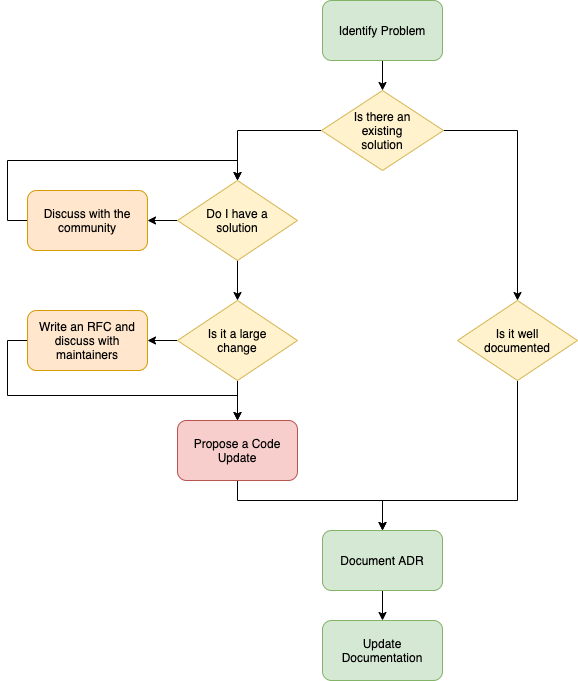

# Overview

_OpenSmartHouse_ is a Smart Building automation framework. The documentation found here aims to support developers wishing to understand the framework to add functionality to the core, or extend the functionality through bindings that interface to hardware, or those that wish to integrate the framework within a wider system.

_OpenSmartHouse_ is written in Java - this provides a portable system that can be deployed to a wide range of hardware. It is also running within an OSGi container - this provides services that allow parts of the framework to interact, and for parts of the system to be modified or upgraded.

# Development Process

We aim to support an open progressive community - both for users and developers. We want your input and support, and in return we aim to provide feedback on our plans, visibility on our decisions, and update roadmaps to allow everyone to understand where we are going. In order to achieve this, we aim to implement the following process for developments.  We have a strong emphasis here on documenting our decisions, and the way the architecture works - both in user and developer documentation, but also in Architectural Decision Records (ADRs). This ensures we know why we've done something, and new developers can also understand our thinking. This can always be challenged as things evolve, but we know why we made a decision in the past, and this is important.

To go with this, we try to work to the following principals -:

* Time is important! RFCs and PRs will be processed in a timely manner. RFCs and issues that are not updated after a reasonable period will be marked as _stale_ and will be closed if not updated. They can of course be re-opened if further information is available, and important issues may be _pinned_ so this policy is waived, but we want to keep things moving, and feel the worst thing we can do is leave things open forever as no-one knows what is happening.

# Development Guide

This guide is written with the developer in mind, but understanding some of the concepts can also be useful for the user. We aim to provide information on the architecture, build environment and major APIs within the framework to allow a developer to modify and extend the system as they require. Of course we are also available to support such integration if required.

* [Fundamental Concepts](fundamentals/index.md)
* [System Architecture](architecture/index.md)
  * [OSGi Fundamentals](architecture/osgi/index.md)
* [Build System](buildsystem/index.md)
* [Discovery Services](discovery/index.md)
* [Bindings](bindings/index.md)
* [Automation Services](automation/index.md)
* [Persistence Services](persistence/index.md)
* [Audio Services](audio/index.md)
* [Transformations](transformations/index.md)
